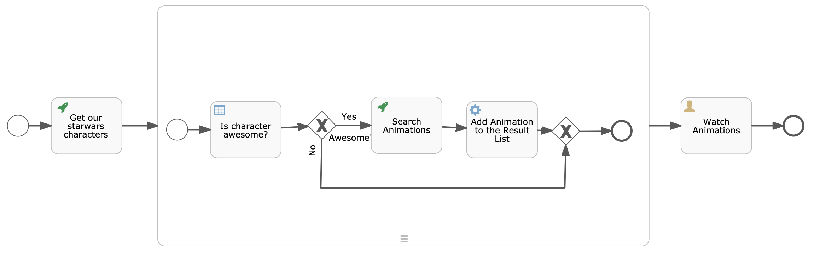
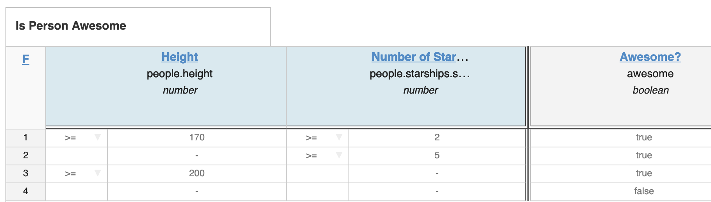

# Awesome Star-Wars Animation Talk

This demo shows how to build a basic BPMN process to search Star Wars characters.
Based on all Star Wars characters found, it will decide if those characters should be displayed.
At the end the process is searching for each character a GIF from Giphy and is displaying them on a basic `GET` request.

## Running the Demo

You need to replace inside the [Star_Wars.bpmn20.xml](src/main/resources/processes/Star_Wars.bpmn20.xml) file `GIPHY_API_KEY` with an actual API key.
Afterwards, you can run the Spring Boot application either with `mvn spring-boot:run` or directly out of your development environment.

It is also possible to push the application to cloud foundry by executing:
```bash
cf push awesome-starwars-animations -p target/awesome-starwars-animations-0.0.1-SNAPSHOT.jar
```

## Modifing or Building the Process Model and Decision Table

To build the same process, you need to install [Flowable](https://flowable.org/) (tested with version 6.4.1).

You have three possibilities:
* Download [Tomcat](https://tomcat.apache.org/download-90.cgi) and put the `war` files from Flowable downloaded zip out of the `wars/` into the `webapps` folder from Tomcat.
* [Deploy it to Cloud Foundry](https://blog.flowable.org/2018/06/11/running-flowable-on-cloud-foundry/).
* [Run Flowable with Docker](https://flowable.org/downloads.html#docker)

You can import the processes out of the [processes](src/main/resources/processes) and the decision table out of the [dmn](src/main/resources/dmn) folders through the import button.

## Screenshots

### Overview over the Process


### Decision Table


### Result
